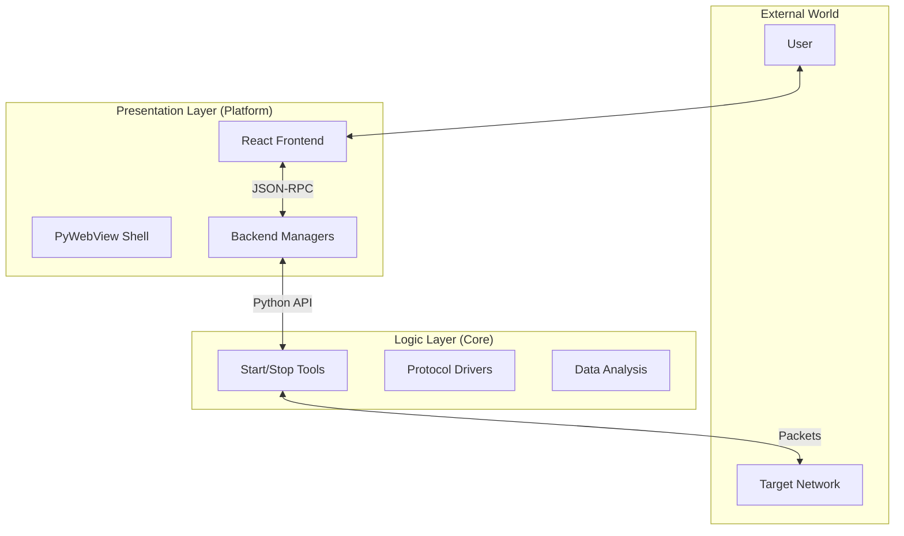

# 系统架构概览

## 核心设计哲学
Nexus 构建于 **“关注点分离 (Separation of Concerns)”** 原则之上。
我们严格将 **业务逻辑 (Core)** 与 **展现层 (Platform)** 进行物理和逻辑上的隔离。

> **原则 1**: `nexus-core` 严禁引用 `nexus-platform`。
> **原则 2**: `nexus-core` 必须能够独立运行（CLI 模式），不依赖 GUI 环境。

## 系统组件全景



### Nexus Core (`nexus-core/`)
- **角色**: 引擎室。
- **内容**: 纯 Python 包。
- **关键接口**: `ITool` (见 `nexus_core.interfaces`)。
- **依赖**: 极简依赖 (numpy, pandas, scapy)。**无任何 GUI 库依赖**。

### Nexus Platform (`nexus-platform/`)
- **角色**: 仪表盘。
- **内容**: 
    - **后端**: Python (基于 Flask 路由风格, 窗口管理, 系统托盘)。
    - **前端**: React + Vite + TailwindCSS。
- **关键逻辑**: 
    - 将 UI 事件分发给特定的 `Managers`。
    - `Managers` 封装 `Core` 工具，处理线程和回调。

## 通信机制

### 前端 -> 后端
- **机制**: `window.pywebview.api.method_name(params)`
- **性质**: 异步 Promise。

### 后端 -> 前端
- **机制**: `window.dispatchEvent(new CustomEvent(type, detail))`
- **设计**: 
    - 采用 **全局事件总线 (Global Event Bus)** 模式。
    - 后端发送通用事件（如 `ping-data`, `log-entry`）。
    - React 组件通过 `useEffect` 订阅感兴趣的事件。

## 目录结构 (Monorepo)

```text
NexusNetworkAnalysis/
├── docs/               # 技术文档库
├── nexus-core/         # [Package] 大脑 (核心逻辑)
│   ├── nexus_core/
│   │   ├── interfaces.py  # 核心契约
│   │   └── plugins/       # 实际工具集
│   └── setup.py
├── nexus-platform/     # [Application] 身体 (应用外壳)
│   ├── backend/        # Python 宿主
│   ├── frontend/       # React 界面
│   └── run.py          # 启动入口
└── scripts/            # 运维脚本
```
