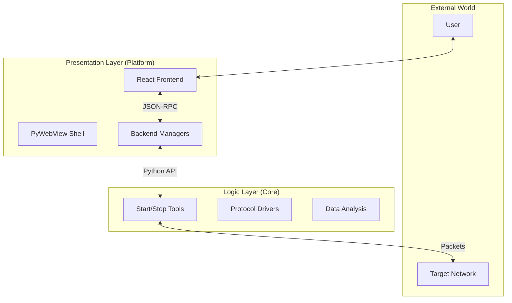

# 系统架构概览

> 文档状态: Draft
> 文档角色: 系统结构参考说明
> 适用范围: `nexus-contracts`、`nexus-core`、`nexus-platform`、前后端通信与分层关系
> 最后更新: 2026-04-21

## 文档定位

本文档用于提供系统结构的快速参考说明，不承担当前仓库治理总纲或项目整体定义文档职责。

涉及项目整体边界、正式仓库结构、版本与构建事实源、文档治理关系时，应优先以下列文档为准：

1. `docs/00-设计概要.md`
2. `docs/03-开发指南.md`
3. `docs/development/11-Repository_Governance_Baseline.md`
4. `docs/development/12-Documentation_Governance_and_Closure_Plan.md`

## 核心设计哲学
Nexus 构建于 **“关注点分离 (Separation of Concerns)”** 原则之上。
我们严格将 **业务逻辑 (Core)** 与 **展现层 (Platform)** 进行物理和逻辑上的隔离。

> **原则 1**: `nexus-core` 严禁引用 `nexus-platform`。
> **原则 2**: `nexus-core` 必须能够独立运行（CLI 模式），不依赖 GUI 环境。

## 系统组件全景


```mermaid
graph TD
    subgraph "External World"
        User
        Network[Target Network]
    end

    subgraph "Presentation Layer (Platform)"
        Shell[PyWebView Shell]
        React[React Frontend]
        Managers[Backend Managers]
    end

    subgraph "Logic Layer (Core)"
        Tools[Start/Stop Tools]
        Drivers[Protocol Drivers]
        Analysis[Data Analysis]
    end

    User <--> React
    React <-->|JSON-RPC| Managers
    Managers <-->|Python API| Tools
    Tools <-->|Packets| Network
```

### Nexus Contracts (`nexus-contracts/`)
- **角色**: 共享契约层。
- **内容**: 跨层复用的契约、共享类型与元数据辅助能力。
- **说明**: 当前仓库已存在 `nexus-contracts/` 目录，但 `ITool` 运行时接口仍位于 `nexus-core/nexus_core/interfaces.py`，因此契约迁移并未完全结束。

### Nexus Core (`nexus-core/`)
- **角色**: 引擎室。
- **内容**: 纯 Python 包。
- **关键接口**: `ITool` (见 `nexus_core.interfaces`)。
- **依赖**: 极简依赖 (numpy, pandas, scapy)。**无任何 GUI 库依赖**。

### Nexus Platform (`nexus-platform/`)
- **角色**: 仪表盘。
- **内容**: 
    - **后端**: Python 宿主、manager、平台能力判断与桥接 API。
    - **前端**: React + Vite + TailwindCSS。
- **关键逻辑**: 
    - 将 UI 事件分发给特定的 `Managers`。
    - `Managers` 封装 `Core` 工具，处理线程和回调。

## 通信机制

### 前端 -> 后端
- **机制**: `window.pywebview.api.method_name(params)`
- **性质**: 异步 Promise。

### 后端 -> 前端
- **机制**: `window.dispatchEvent(new CustomEvent(type, detail))`
- **设计**: 
    - 采用 **全局事件总线 (Global Event Bus)** 模式。
    - 后端发送通用事件（如 `ping-data`, `log-entry`）。
    - React 组件通过 `useEffect` 订阅感兴趣的事件。

## 目录结构 (Monorepo)

```text
NexusPlatform/
├── docs/                    # 正式文档与工程规范
├── build-system/            # 统一构建入口
├── profiles/                # 构建与功能 profile
├── nexus-contracts/         # 共享契约层
├── nexus-core/              # 逻辑实现层
│   ├── nexus_core/
│   │   ├── interfaces.py    # 当前 ITool 定义位置
│   │   └── plugins/         # 实际工具集
│   └── setup.py
├── nexus-platform/          # 桌面宿主层
│   ├── backend/             # Python 宿主与桥接层
│   ├── frontend/            # React 界面
│   ├── config/              # 配置与版本事实源
│   └── run.py               # GUI 启动入口
├── scripts/                 # 仓库级包装脚本
└── tools/                   # 外部工具资源
```
