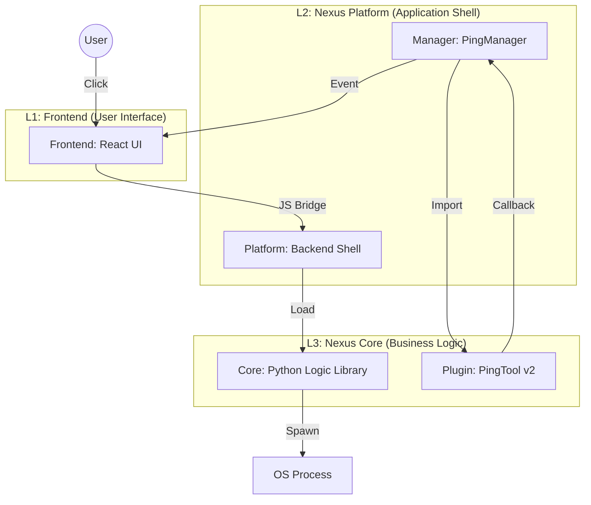

# Nexus Platform 核心架构与代码追踪：以 Ping 为例

本文档旨在通过 **Ping 工具** 的完整执行流程，深度解析 Nexus Platform v1.4 的新一代分层架构 (Core/Platform Split)。

## 架构总览

新架构采用了 **“核心分离 (Core Split)”** 模式，将业务逻辑与 GUI 展现层彻底解耦。



### 关键技术栈

| 层级                   | 技术组件                | 职责                                                                                           |
| :--------------------- | :---------------------- | :--------------------------------------------------------------------------------------------- |
| **L1 FrontendWrapper** | React 18 + Vite         | 处理用户交互与数据可视化 (Canvas/ECharts)。                                                    |
| **L2 Platform**        | Python + PyWebView      | 负责窗口管理 (WebView2)、OS 交互、系统托盘、自动更新。作为宿主容器。                           |
| **L3 Managers**        | Python (Platform Layer) | **适配层**。将 Core 的原子能力封装为前端可用的 API。处理线程、状态管理。                       |
| **L4 Nexus Core**      | Python (Pure Library)   | **核心资产**。无 GUI 依赖，纯 Python 逻辑。包含所有测试仪器的驱动代码。可复用于 CLI 或 CI/CD。 |

---

## 代码流程追踪

让我们追踪一次 Ping 操作的全生命周期，从用户点击按钮到数据上屏。

### 步骤 1: Feontend - 发起请求 (PingPanel.jsx)
- **动作**: 用户点击 `Start` 按钮。
- **代码**:
    ```javascript
    const handleStart = async (id, config) => {
        // 调用 PyWebView 暴露的 API
        const res = await window.pywebview.api.ping_start(config);
        if (res.status === 'started') {
            updateStatus(id, 'running');
        }
    };
    ```

### 步骤 2: Platform - 路由分发 (app.py)
- **职责**: `Api` 类是所有前端请求的入口。
- **代码**:
    ```python
    class Api:
        def __init__(self):
            # 初始化管理器
            self._ping_manager = PingManager(self.base_dir)

        def ping_start(self, config):
            """Route to Ping Manager"""
            return self._ping_manager.run(config)
    ```

### 步骤 3: Manager - 适配与回调注入 (managers/ping.py)
- **职责**: 连接 Platform 与 Core。最关键的是定义了 **Callback**，让无状态的 Core 能把数据传回有状态的前端。
- **代码**:
    ```python
    from nexus_core.plugins.network.nexus_ping.tool_v2 import PingTool

    class PingManager(BaseManager):
        def __init__(self, base_dir):
            self.tool = PingTool(base_dir) # 实例化 Core 中的工具

        def run(self, config):
            # 定义回调函数：当 Core 产生数据时，通过这里传回前端
            def callback(event, payload):
                # self.send_to_js 是 BaseManager 提供的功能
                # 它会触发 window.dispatchEvent(new CustomEvent(event ...))
                self.send_to_js({'type': event, 'detail': payload})
            
            # 将执行权移交 Core
            return self.tool.run(config, callback=callback)
    ```

### 步骤 4: Core - 业务逻辑执行 (tool_v2.py)
- **职责**: 真正的干活层。执行复杂的 Ping 命令拼接、进程管理、输出解析。**它不知道前端的存在**，只知道往 `callback` 里塞数据。
- **代码**:
    ```python
    class PingTool(ITool):
        def run(self, config, callback=None):
            # 1. 组装命令 (跨平台适配)
            cmd = ['ping', '-t', config['host']] 
            
            # 2. 启动子线程执行，避免阻塞主线程
            t = threading.Thread(target=self._worker, args=(cmd, callback))
            t.start()
            return {"status": "started"}

        def _worker(self, cmd, callback):
            # 3. 调用 OS 子进程
            process = subprocess.Popen(cmd, stdout=subprocess.PIPE, ...)
            
            # 4. 实时解析输出
            while True:
                line = process.stdout.readline()
                data = self._parse_ping_output(line)
                
                # 5. 通过回调上报数据
                if callback:
                    callback('ping-data', data)
    ```

### 步骤 5: Frontend - 数据渲染 (App.jsx)
- **机制**: 全局事件总线监听。
- **代码**:
    ```javascript
    // App.jsx: 接收后端事件并派发为 DOM 事件
    window.processEvents = (events) => {
        events.forEach(e => window.dispatchEvent(new CustomEvent(e.type, { detail: e.detail })));
    };

    // PingPanel.jsx: 监听特定事件
    useEffect(() => {
        const handleData = (e) => {
            // 更新图表与统计状态
            setChartData(prev => [...prev, e.detail.data]);
        };
        window.addEventListener('ping-data', handleData);
    }, []);
    ```

---

## 设计原理解析

### 可复用性
`nexus-core` 可以被其他项目直接引用（比如自动化测试脚本、CI/CD 流水线），而无需启动笨重的 GUI。

### 稳定性
GUI 崩溃不影响底层逻辑；底层逻辑报错可以通过 Manager 捕获，不至于让整个界面白屏。

### 开发效率
算法工程师专注于 `nexus-core` (Python)，前端工程师专注于 `nexus-platform/frontend` (React)，通过清晰的 JSON 协议对接。

## 扩展指南：如何开发新工具

1.  **Core 层**: 在 `nexus-core/plugins` 下创建新工具类，继承 `ITool`，实现 `run(config, callback)`。
2.  **Manager 层**: 在 `nexus-platform/backend/managers` 下创建 Wrapper，实例化 Core 工具。
3.  **App 层**: 在 `app.py` 中注册 Manager 方法。
4.  **UI 层**: 在前端创建 React 组件，调用 API。

---

## 未来演进：会话型工具

针对如 **RTP 分析** 这样需要多步交互、维持上下文的复杂场景，单一的 `ITool.run` 接口已不足以支撑。我们计划引入 **Action-Based** 的状态机模型。

### 痛点分析
现有的 `ITool` 假设任务是 "Fire & Forget" (一键发射)，输入配置 -> 等待流式结果。
但复杂业务通常包含：
1.  **阶段一**: 上传大文件、预处理、建立索引（如：解析 500MB PCAP）。
2.  **阶段二**: 用户根据结果选择特定对象进行深入分析。
3.  **阶段三**: 释放内存、清理缓存。

### 解决方案：IInteractiveTool 接口提案

```python
class IInteractiveTool(ITool):
    """
    Interface for tools that require persistent state or multi-step user interaction.
    """
    
    @abstractmethod
    def start_session(self, config: Dict) -> str:
        """
        Initialize the context. 
        Example: Open PCAP file, parse headers.
        Returns: session_id
        """
        pass

    @abstractmethod
    def execute_action(self, session_id: str, action: str, params: Dict) -> Dict:
        """
        Execute specific action in session context.
        """
        pass
```


